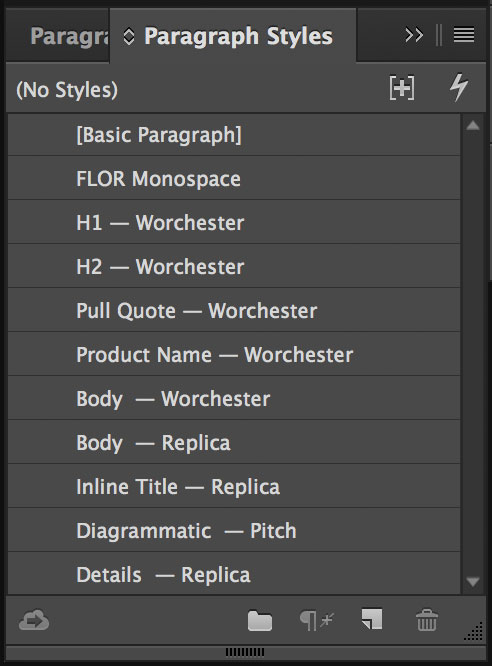
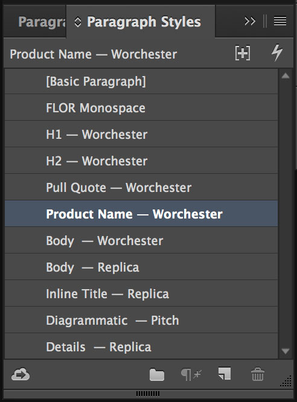

Paragraph styles have been established to quickly pick up and use in any hand-held sized print materials. Do not create additional styles — these styles are designed to cover all needs. Simply load in the paragraph styles from the guidelines document by going to the menu within the Paragraph Styles palette, selecting Load Paragraph Styles and finally choosing this document.

 