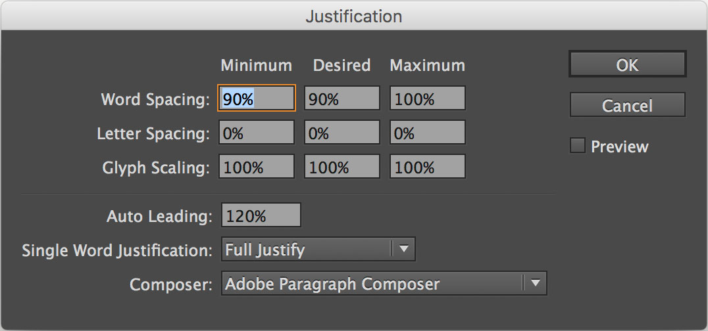

All instances of Worchester EF should have an altered Word Spacing of 90%, 90%, 100%. Word Spacing can be accessed through Paragraph Styles > Style Options > Justification or through Paragraph > Options > Justification.

